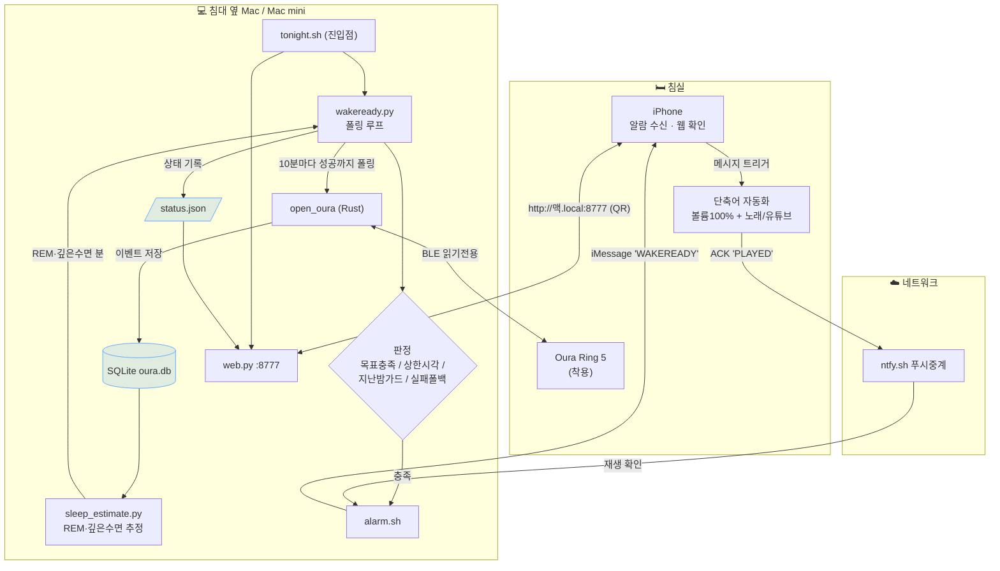

# WakeReady ⏰

**Oura 링으로 "푹 잤을 때" 아이폰에서 노래로 깨워주는 스마트 알람.**

고정 시각에 울리는 보통 알람과 달리, 자는 동안 링 데이터를 실시간으로 읽어 **목표만큼(또는 건강하게) 잤다고 판단되면** 그때 깨웁니다. 공식 앱/클라우드는 실시간 판정이 안 되므로([데이터가 기상 후에야 서버로 감](PRD.md)), [open_oura](https://github.com/Th0rgal/open_oura)로 **링과 블루투스(BLE) 직접 통신**해 밤중에 판정합니다.

> 클라우드 미접촉 · 읽기 전용(공식 앱 무손상) · 무료 · 개인용

---

## 어떻게 동작하나요?

1. **밤새 폴링** — 침대 옆 맥이 10분마다 링을 읽어 누적 수면·REM·깊은수면을 계산
2. **기상 판정** — 목표 수면(기본 8시간) 또는 "건강 수면" 조건 충족 시 결정
3. **아이폰 알람** — 맥이 iMessage를 보내면 → 아이폰 단축어가 **볼륨 100%로 노래/유튜브 재생** (앱 상주 불필요)



---

## 준비물

- **Oura Ring** (Gen 3/4/5) — 잘 때 착용
- **Mac** — 침대에서 BLE가 닿는 거리(~5m)에 두고 밤새 켜둘 것 (헤드리스 Mac mini도 OK)
- **iPhone** — 알람이 울릴 기기 (맥과 같은 와이파이 + 같은 Apple ID의 iMessage)

---

## 설치 (처음 한 번)

### 1. 코드 받고 빌드
```bash
git clone https://github.com/CreatiCoding/oura-morning-on-mac
cd oura-morning-on-mac
./scripts/setup.sh                 # open_oura 빌드
pip install -r requirements.txt    # (선택) 접속 QR 표시용
cp .env.example .env               # 설정 파일 생성
```

### 2. 링 인증 키 넣기 🔑
링과 통신하려면 16바이트 인증 키가 필요합니다. **iPhone 암호화 백업에서 1회 추출** →
`.env`의 `OURA_AUTH_KEY`(또는 `key.hex`)에 저장.
→ 자세한 절차: **[SETUP.md](SETUP.md)**

확인:
```bash
./bin/oura --key-file key.hex info   # 배터리 %까지 나오면 성공
```

### 3. 아이폰 알람 만들기 📱
**단축어 앱 → 자동화 → 새 자동화 → 메시지**
- 조건: "메시지 포함 내용" = `WAKEREADY`, **즉시 실행** 선택
- 동작: `볼륨 설정 100%` → `음악 재생`(또는 유튜브 `URL 열기`)
- (권장) 마지막에 재생 확인 신호 1개 → 맥이 "실제로 울렸는지" 확인

그리고 `.env`에 `IMESSAGE_TARGET=+8210…`(아이폰 번호) 입력.
→ 자세한 절차(재생 확인 ACK 포함): **[USAGE.md](USAGE.md)**

---

## 매일 밤 사용

```bash
caffeinate -s ./scripts/tonight.sh --tui
```
이 **한 줄**이 웹서버 + 폴링을 함께 실행하고, 종료(Ctrl+C) 시 자동 정리합니다.
(`caffeinate -s` = 밤새 맥이 안 자게. `--tui` = 예쁜 실시간 카드)

**취침 전 체크리스트:**
- 💍 링 착용
- 📴 아이폰 **블루투스 OFF** (안 그러면 아이폰이 링을 점유해 맥이 못 읽음 — 알람 푸시는 와이파이라 무관)
- 🔊 아이폰 **무음 스위치 OFF**
- 📍 맥이 침대 근처(BLE 범위)

→ 건강하게 자면 노래로 깨우고, 못 채우면 **안전 상한 시각(기본 09:00)에 무조건** 깨웁니다.

### 📱 폰에서 상태 보기
실행하면 터미널에 **접속 주소 + QR**이 떠요. **폰 카메라로 QR 스캔** → 실시간 수면 대시보드가 열립니다.
- 주소: `http://<맥이름>.local:8777` (같은 와이파이)
- 수면시간·REM·깊은수면·품질이 보이고, **"지금 동기화" 버튼**으로 즉시 갱신 가능

---

## 잘 안 될 때

| 증상 | 확인 |
|------|------|
| `no matching Oura ring found` | 아이폰 블루투스 OFF? 링 착용? 맥이 가까이? (10분 창 안에서 자동 재시도됨) |
| 아이폰에서 노래 안 울림 | 단축어 자동화 "즉시 실행"인지, 트리거 단어 `WAKEREADY` 일치, 무음 OFF |
| 웹페이지 안 열림 | `tonight.sh` 실행 중인지(웹서버 같이 뜸), 같은 와이파이인지 |
| 지금 상태만 빨리 보고 싶다 | `python3 scripts/wakeready.py --once` |
| 알람만 테스트 | `python3 scripts/wakeready.py --test-alarm` |

---

## 설정 (`.env`, 주요 항목)

| 키 | 뜻 | 기본 |
|----|----|----|
| `TARGET_SLEEP_HOURS` | 목표 수면 시간 | 8 |
| `CAP_TIME` | 안전 상한 시각(무조건 기상) | 09:00 |
| `HEALTHY_MODE` | 1이면 REM/깊은수면 조건 추가 | 0 |
| `REM_MIN_MIN` / `DEEP_MIN_MIN` | 건강모드 목표(분) | 70 / 55 |
| `IMESSAGE_TARGET` | 알람 보낼 아이폰 번호 | — |

전체 항목은 `.env.example` 주석 참고.

---

## 더 알아보기
- **[USAGE.md](USAGE.md)** — 상세 사용법 · 테스트 플래그 · 알람 ACK
- **[SETUP.md](SETUP.md)** — 맥 셋업 · 인증키 추출
- **[PRD.md](PRD.md)** — 왜 이렇게 만들었나(설계 배경)

## 주의
- 개인용. `.env`·`key.hex`·`data/`(건강데이터)는 커밋 금지(`.gitignore` 처리됨).
- 수면단계(REM/깊은수면)는 **원시신호 기반 추정치**입니다(공식 모델 없이 근사). 며칠 로그로 본인 기준 보정 권장.
- 비공식 BLE 프로토콜 — 펌웨어 업데이트로 동작이 바뀔 수 있음(그래도 폴백 알람은 상한 시각에 울림).
